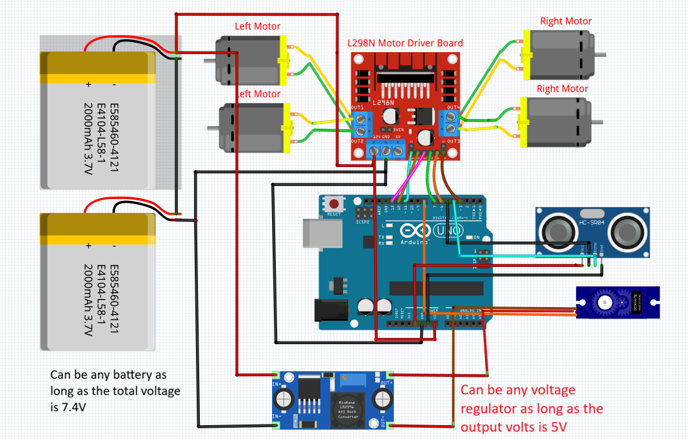
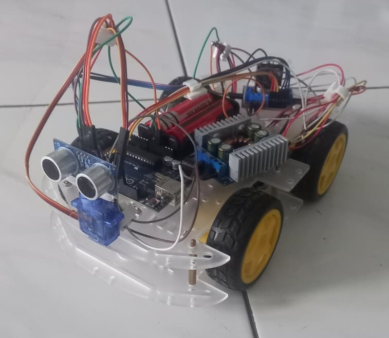

# Obstacle Avoiding Robot

An obstacle avoiding robot made using an Arduino Uno and Ultrasonic sensor + servo combination to decide the steer.

The robot works by running a reactive program by detecting distance, when the robot runs and the ultrasonic sensor reaches a set distance, it stops and evaluate. The servo helps the Ultrasonic sensor by turning the sensor left and right, thus taking the data of the distance from left and right. After taking the data, the distances are evaluated to see which path is the most optimal one.

## Components used
- Arduino Uno R3(Although this is interchangeable if you know what you're doing)
- SG90 Servo
- HC-SR04 Ultrasonic Sensor(again this is interchangeable)
- 4x DC motors
- 4x Gearbox(optional)
- L298N Motor Driver(interchangeable depending on your needs)
- A chassis kit(or you can 3D print them but I personally didn't)
- A step down buck converter(Optional but I used them for my servos)
- 2x 18650 Batteries(interchangeable with LiPo batteries or a far more powerful battery if you know what you're doing)
- 2 Battery holder

## 🔌 Pin Connections

| Component | Pin |
|-----------|-----|
| Left Motor Control (ENA) | 11 |
| Left Motor Direction1 (IN1) | 12 |
| Left Motor Direction2 (IN2)13 |
| Right Motor (PWM) | 3 | 
| Right Motor Direction1(IN3) | 7 | 
| Right Motor Direction2(IN4)| 6 |
| L298N VSS|Straight from battery|
| Servo Power|Use a buck converter|
| Servo Signal | 8 |
|Ultrasonic VCC|5V Arduino|
| Ultrasonic Trigger | 5 |
| Ultrasonic Echo | 4 |
| all Ground | GND |

## Common Problems
- **The Servo.h library disables pin 9 and 10 for PWM uses. Configure the pins however you want but mind these restrictions.***
- **The Servo can't handle the 7.4V from the battery, I suggest using a buck converter so your Servo can operate safely.**

The pin configurations in the code are interchangeable on
- Supersonic  = line 3 & 4
- DC motor = line 6-12
- Servo = line 13

## KiCad Schematic Notes
The schematic was designed in KiCad using a custom HC-SR04 footprint/symbol. 
If you're opening the `.kicad_sch`file and get missing library errors, you can:
1. Download the library from [here](https://easyeda.com/component/f187369ca0be419ab766c123244e74c4)

## Circuit Diagram

## Finished

## Demo
https://github.com/user-attachments/assets/3725869f-7dd5-4e9e-bc3b-e63787a0f5e3

